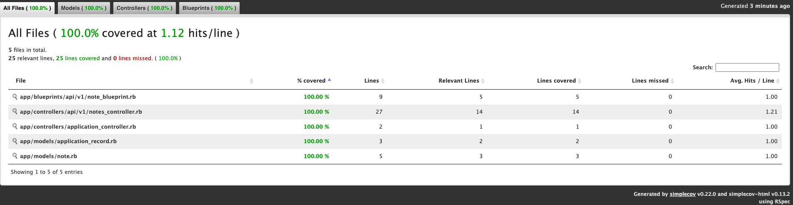

# 📝 Notes App — API + Frontend

Aplicação simples de anotações, desenvolvida como teste técnico, utilizando Ruby on Rails (API) e Vue.js, com foco em organização, testes automatizados e execução via Docker.

## 🚀 Tecnologias Utilizadas
* Backend
* Ruby 3.3
* Rails 8 (API-only)\
* PostgreSQL
* RSpec
* FactoryBot
* SimpleCov (cobertura de testes)
* Blueprinter (serialização JSON)
* Frontend
* Vue 3
* Vite
* Axios
* Infra
* Docker
* Docker Compose

## 📦 Estrutura do Projeto
````shell
notes-app/
├── backend/              # API Rails
│   ├── app/
│   │   ├── controllers/
│   │   ├── models/
│   │   └── blueprints/
│   ├── spec/             # Testes automatizados
│   └── db/
├── frontend/             # Vue 3 + Vite
├── docker-compose.dev.yml
└── README.md
````

## ▶️ Como Executar o Projeto
* Pré-requisitos
* Docker
* Docker Compose (v2+)
* Subir a aplicação
* docker compose -f docker-compose.dev.yml up --build
* Após subir:
* Frontend: http://localhost:5173
* Backend (API): http://localhost:3000

## 🔗 Endpoints da API

### Base URL:
/api/v1
### Listar anotações
* GET /api/v1/notes

### Criar anotação
* POST /api/v1/notes
````json
{
    "note": {
        "title": "Minha anotação",
        "content": "Conteúdo opcional"
    }
}
````
#### ⚠️ Formato de Erros

Em caso de erro de validação, a API retorna:
````json
{
    "errors": [ "Título não pode ficar em branco"]
}
````
## 🧪 Testes Automatizados

Os testes utilizam RSpec, com request specs e model specs, focando no comportamento real da API.

* Rodar os testes
```shell
docker compose -f docker-compose.dev.yml exec backend bundle exec rspec
```

* Resultado esperado:
  * X examples, 0 failures 

## 📊 Cobertura de Testes

A cobertura é gerada com SimpleCov, focada em código de negócio:

* Models
* Controllers
* Blueprints

#### Após rodar os testes, o relatório é gerado em:
````
backend/coverage/index.html
````

Abra o arquivo no navegador para visualizar.

## 🧠 Decisões Técnicas

* API versionada (/api/v1) para facilitar evolução futura
* Request specs para validar o comportamento real da API
* Cobertura focada apenas em código relevante (sem infra)
* Docker como ambiente padrão para garantir reprodutibilidade
* Serialização explícita do JSON via Blueprinter

## 📌 Observações

O projeto foi desenvolvido com foco em clareza, simplicidade e boas práticas

Funcionalidades como autenticação, exclusão e paginação podem ser adicionadas facilmente

O objetivo principal foi demonstrar organização, testes e domínio do stack

👨‍💻 Autor

Gabriel Flauzino Mota 
[LinkedIn](https://www.linkedin.com/in/gabriel-flauzino-mota/) 

## Bonus
Para consulta a cobertura [este arquivo num browse](coverage/index.html) foi utilizado a gem coverage
Aqui está o painel principal:

